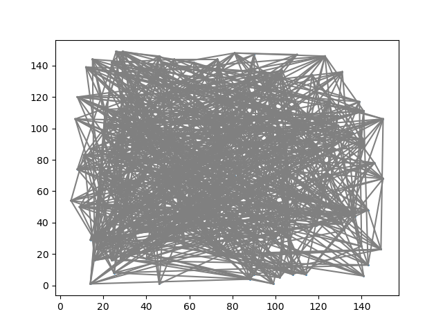
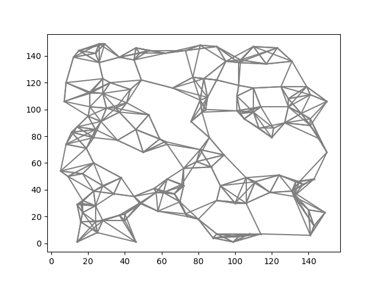
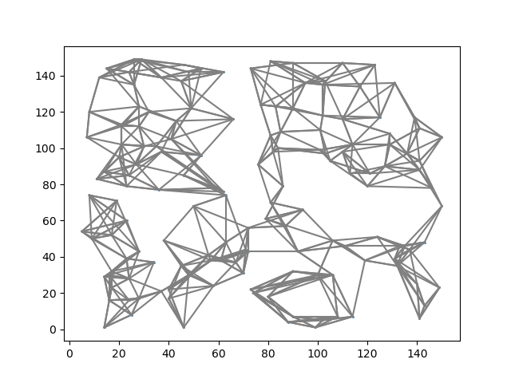

# WEAVESS

**WEAVESS** is a frame for testing graph-based approximate nearest neighbor search (ANNS) algorithms' components.

## Algorithms

### Algorithms' Components

|  Algo  |      TYPE      |          Init         |     Entry      |   Candidate   |    Prune    |     Conn     |    Search Entry    |    Search Route    |
|:------:|:--------------:| :--------------------:| :------------: | :-----------: | :----------:| :-----------:| :-----------------:|:------------------:|
| KGraph |                |     NN-Descent        |                |               |             |              |                    |                    |
| NSG    |   Refinement   |     NN-Descent        |    Centroid    |     Greedy    |    MRNG     |     DFS      |    MRNG            |           DFS      |
| SSG    |   Refinement   |     NN-Descent        |                | PROPAGATION 2 |    SSG      |  DFS_Expand  |    SSG             |        DFS_Expand  |
| DPG    |   Refinement   |     NN-Descent        |                | PROPAGATION 1 |    DPG      |    Reverse   |    DPG             |          Reverse   |
| VAMANA |   Refinement   |       Random          |    Centroid    |     Greedy    |    VAMANA   |    Reverse   |    VAMANA          |          Reverse   |
| EFANNA |   Refinement   |       KD-tree         |                |               |             |              |                    |                    |
| IEH    |   Refinement   |                       |                |               |             |              |                    |                    |
| HNSW   |   Increment    |                       |                |      Naive    |  HEURISTIC  |              |  HEURISTIC C  C    |                    |
| NSW    |   Increment    |                       |     Random     |      Naive    |             |              |                    |                    |
| HCNGG  |Divide & Conquer|Hierarchical Clustering|                |               |             |              |                    |                    |
| SPTAG  |Divide & Conquer|      TP-tree          |                |               |             |              |                    |                    |
| FANNG  |                |                       |                |               |             |              |                    |                    |
| NGT    |                |                       |                |               |             |              |                    |                    |

### Performance

#### [KGraph](https://github.com/aaalgo/kgraph)

* **K** : 'K' of K-NNG
* **L** : candidate pool size, larger is more accurate but slower, no smaller than K.
* **ITER** : NN-Descent iteration times, iter usually < 30.
* **S** : number of neighbors in local join, larger is more accurate but slower.
* **R** : number of reverse neighbors, larger is more accurate but slower.

|  Dataset  |  K  |  L  | ITER |  S |  R  |
|:---------:|:---:|:---:|:----:|:--:|:---:|
| SIFT1M    | 200 | 200 |  12  | 10 | 100 |
| GIST1M    | 400 | 400 |  12  | 15 | 100 |
| Crawl     | 400 | 420 |  12  | 15 | 100 |
| GloVe-100 | 400 | 420 |  12  | 20 | 200 |

### EFANNA

* **nTrees** : 'nTrees' is the number of trees used to build the graph (larger is more accurate but slower)
* **mLevel** : conquer-to-depth (smaller is more accurate but slower) 

* **K** : 'K' of K-NNG
* **L** : candidate pool size, larger is more accurate but slower, no smaller than K.
* **iter** : NN-Descent iteration times, iter usually = 4
* **S** : number of neighbors in local join, larger is more accurate but slower.
* **R** : number of reverse neighbors, larger is more accurate but slower.

|  Dataset  |  nTrees | mLevel |  K  |  L  | iter |  S |  R  |
|:---------:|:-------:|:------:|:---:|:---:|:----:|:--:|:---:|
| SIFT1M    |    8    |  8     | 200 | 200 | 4    | 10 | 100 |

### NSG

+ **L_nsg** : controls the quality of the NSG, the larger the better.
+ **R_nsg** : controls the index size of the graph, the best R is related to the intrinsic dimension of the dataset.
+ **C_nsg** : controls the maximum candidate pool size during NSG contruction.

| Dataset |  L_nsg |  R_nsg |  C_nsg  |
|:-------:|:--:|:--:|:---:|
|  SIFT1M | 40 | 50 | 500 |
|  GIST1M | 60 | 70 | 500 |

### NSSG

|  Dataset  |  L  |  R  | Angle |
|:---------:|:---:|:---:|:-----:|
| SIFT1M    | 100 | 50  |  60   |
| GIST1M    | 500 | 70  |  60   |
| Crawl     | 500 | 40  |  60   |
| GloVe-100 | 500 | 50  |  60   |

### DPG

* **L_dpg** : neighbors per data point, the value is half of KGraph.

### VAMANA

### HCNNG

* **S** ： min size cluster
* **N** : number of clusters

### SPTAG

to be continue

## Search Parameters

+ `SEARCH_K` controls the number of result neighbors we want to query.
+ `search_L`: range from `search_K` to 2000, controls the quality of the search results, 
the larger the better but slower. The `SEARCH_L` cannot be samller than the `SEARCH_K`

## Components

### Init

#### Random

  
 

#### NN-Descent

  
 

#### KD-Tree

  
 

## Evaluation criteria

* Speedup : Collection size / Number of distance calculations

## Contributing to the repository

Contributions are highly welcome!

Please make pull requests against the `dev` branch.

## TODO

-[ ] KGraph

-[ ] IEH

-[ ] EFANNA

-[ ] DPG

-[ ] NSG

-[ ] NSSG

-[ ] NSW

-[ ] HNSW

-[ ] NGT

-[ ] FANNG

-[ ] Vamana

-[ ] HCNNG

* 整体评价
    * 搜索性能
        * 评价指标：召回率、Speed-up、(QPS _ 需修改代码支持 SIMD)
        * 数据库内查询和数据库外查询比较
        * 可扩展性：不同数据集
        * 达到相同召回率时候选集的尺寸、相同尺寸候选集下不同算法的召回率
        * 查询时入口点到终止点的平均路径长度
    * 构建性能
        * 索引构建时间，索引尺寸
        * 最优搜索性能下，近邻图质量（k个邻居中是k个最近邻的百分比）和对应的召回率；
        * 最大出度、平均出度
        * 不同邻居数对不同构图方法构建性能和索引性能的影响（可以邻居数k取几个特定的值，比如10，50，100，然后再通过Queries Per Second vs Recall评估）。
        * 连通分量数

* 评价指标 ： 
    * 召回率、 Speed-up
* route 缺失 flag
* IEH 实现
* 重写 HCNNG MST 算法， 去掉原数据结构
* 分离算法接口与 IndexBuilder 接口
* SIMD 优化
* 检查数据结构是否清空
* 检查参数是否合法 （nmslib Check）
* id 数据类型 （nmslib idtype）

* KGraph 、 NSG 、 NSSG 、DPG 、EFANNA 搜索测试
* DPG 、 EFANNA 整体构建测试
* HNSW final_graph 
* VAMANA 实现区别 ：论文构建中添加反向边， 本项目实现论文后添加反向边
* InterInsert